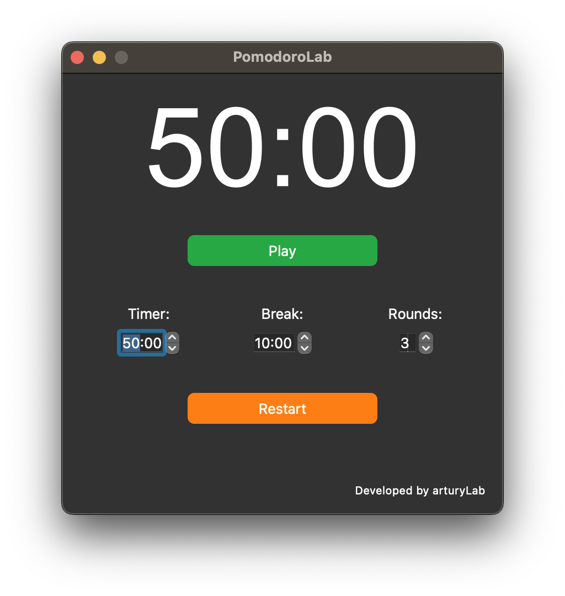

# 🍅 PomodoroLab

A customizable Pomodoro Timer application built with PyQt5 that helps you manage your work sessions and breaks effectively.

## ✨ Features

- **⏱️ Customizable Work Sessions**: Set your preferred work duration
- **☕ Adjustable Break Periods**: Configure short breaks between work sessions
- **🔄 Multiple Rounds**: Set up to 10 consecutive work/break cycles
- **👁️ Visual Timer**: Large, easy-to-read countdown display
- **🔔 Audio Alerts**: Sound notification when sessions end
- **📊 Session Tracking**: Shows current session status and progress

## 📋 Requirements

- Python 3.6+
- PyQt5
- PyQt5.QtMultimedia

## 🚀 Installation

1. Clone this repository:
https://github.com/arturylab/pomodoroLab.git
