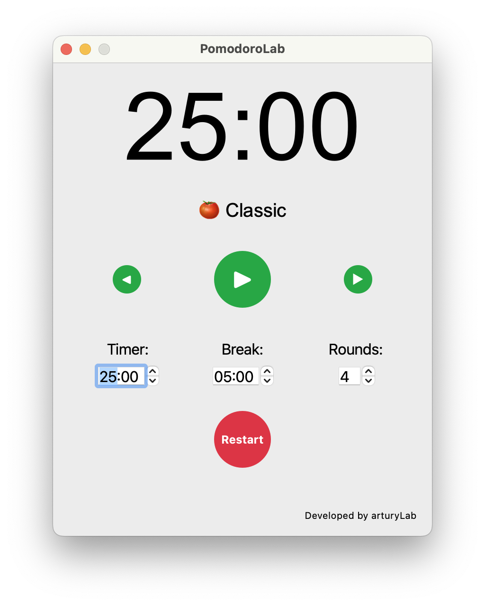

# 🍅 PomodoroLab

A customizable Pomodoro Timer application built with PyQt5 that helps you manage your work sessions and breaks effectively.

## Screenshot



## ✨ Features

- **⏱️ Customizable Work Sessions**: Set your preferred work duration.
- **☕ Adjustable Break Periods**: Configure short breaks between work sessions.
- **🔄 Multiple Rounds**: Set up to 10 consecutive work/break cycles.
- **👁️ Visual Timer**: Large, easy-to-read countdown display.
- **🔔 Audio Alerts**: Sound notification when sessions end.
- **📊 Session Tracking**: Shows current session status and progress.
- **🎯 Predefined Configurations**: Choose from five modes:
  - 🍅 **Classic**: 25-minute work sessions with 5-minute breaks.
  - 🎯 **Deep Focus**: 50-minute work sessions with 10-minute breaks.
  - ⏳ **60/15 Technique**: 60-minute work sessions with 15-minute breaks.
  - ⚡ **Short Sprint**: 15-minute work sessions with 3-minute breaks.
  - 🔄 **Flex Mode**: 20-minute work sessions with 5-minute breaks.
- **🔄 Easy Configuration Switching**: Navigate between predefined configurations using intuitive buttons.
- **🚀 Motivational Emojis**: Visual indicators for session progress.

## 📋 Requirements

- Python 3.6+
- PyQt5
- PyQt5.QtMultimedia

## 🚀 Installation

1. Clone this repository:
   ```bash
   git clone https://github.com/arturylab/pomodoroLab.git